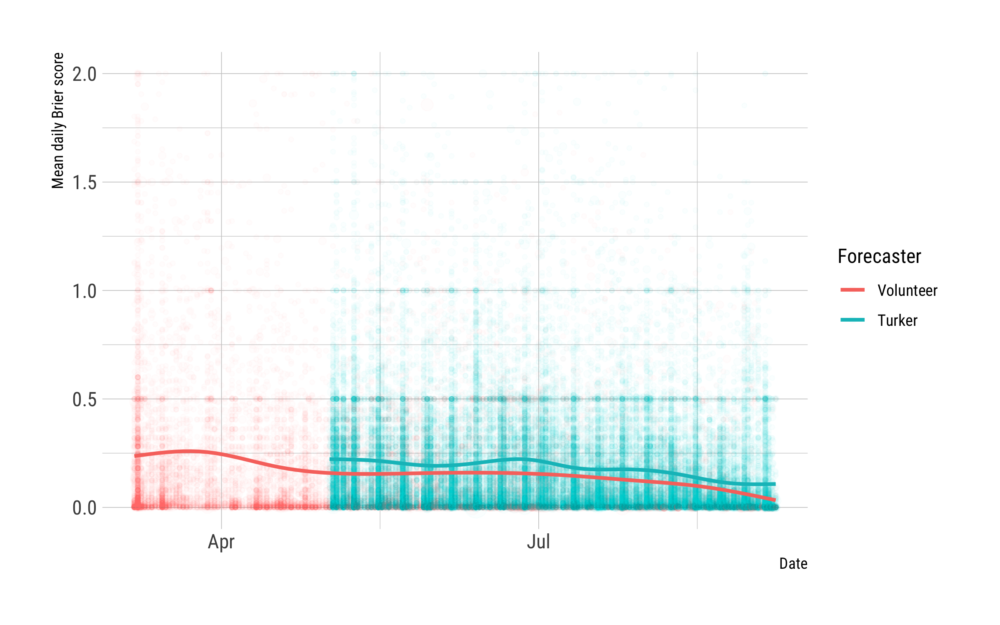
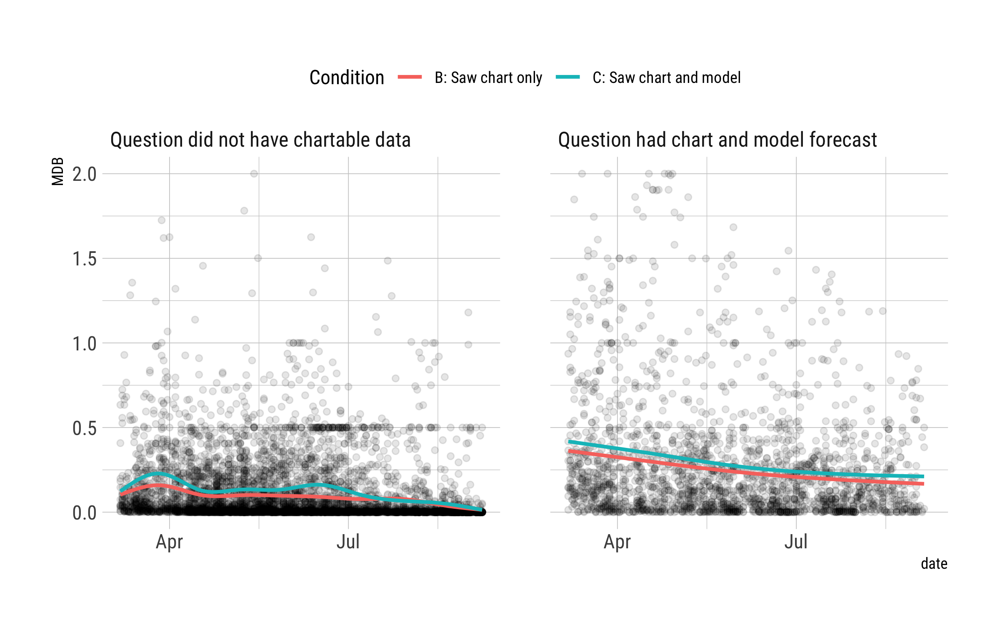

```{r setup, include=FALSE}
knitr::opts_chunk$set(echo = FALSE, warning = FALSE, message = FALSE)

library("tidyverse")
```

```{r load-data}
dropbox_path <- "~/Dropbox/Work/asia-polmeth-2019"
in_dir  <- file.path(dropbox_path, "input-data")
out_dir <- file.path(dropbox_path, "output")

fcasts <- read_rds(file.path(out_dir, "user_forecasts_w_features.rds")) %>%
  mutate(date = as.Date(date),
         x = as.numeric(date) - min(as.numeric(date)),
         sees_chart = sees_chart==1,
         sees_model = sees_model==1) 
```


The Hybrid Forecasting Competition (HFC)^[**Funding acknowledgement**: This research is based upon work supported in part by the Office of the Director of National Intelligence (ODNI), Intelligence Advanced Research Projects Activity (IARPA), via 2017-17071900005. The views and conclusions contained herein are those of the authors and should not be interpreted as necessarily representing the official policies, either expressed or implied, of ODNI, IARPA, or the U.S. Government. The U.S. Government is authorized to reproduce and distribute reprints for governmental purposes notwithstanding any copyright annotation therein.] is an IARPA program that seeks to develop methods for hybrid geopolitical forecasting system that combine human and machine forecasts to answer a broad range of questions about economic, political, health, and other events and trends. The first trial period, or RCT, took place in 2018, during the course of which hundreds of volunteer and Amazon Mechnial Turk forecasters, as well as automated machine models, answered more than 150 questions covering a broad range of issues. 

We worked on one of the competition teams, and specifically by contributing a time series forecasting module. Out of the large set of interesting questions one could examine with the results so far, given our specific focus on this project, we will try to examine in this paper two questions: (1) how does the accuracy of turker forecasters compare to volunteer forecasters, and (2) what was the impact of the machine forecasts on human forecaster accuracy?

# The Hybrid Forecasting Competition

The goal of the HFC is to find ways to optimally combine human and machine forecasts. For example, machine forecasts can be reliable and scalable, but are constrained by available data, idiosyncratic questions, and cold start problems when a corpus of historical data is not available. Human-generated forecasts on the other hand are more flexible, but also more costly to scale and subject to various cognitive biases.[e.g. @kahneman:2011]. 

The competition is organized around a series of official trial periods ("RCTs") during which forecasters can actively forecast on official competition questions, and the results of which are used for subsequent project evaluations. Time between the trial periods is reserved for development and improvements, as well as any internal, non-official experiments performers might choose to run. 

During the trial periods, performer teams are competing against a reference forecast, with the ultimate goal being to find methods or tools that provide superior forecasts. 

Each entry, at the core, consists of a Good Judgement-style platform that can receive competition questions (IFPs in project parlance) and show them to users, who then provide probabilistic forecasts for a set of 2-5 answer options. 

The original goal was for the project to recruit a sufficient number of volunteer forecasters to provide each performing team with the numbers needed to forecast at the rate at which questions are generated during the trial periods. When it became apparent, several weeks into the first trial period, that the level of forecasting activity was not going to be sufficient for adequate evaluations, a contingency plan was activated whereby additional forecasters (turkers) were provided with Amazon Mechnanical Turk. 

## SAGE approach

One of the features of our project's platform is functionality that for questions that have a clearly associated data stream, e.g. questions about interest rates or gold prices, acquires the relevant data source and displays it to users in a chart. 

This same data platform also feeds a module, "basil-ts", that uses a simple time series model to derive probabilties for the question answer options. This was one of our main machine-forecast providers during the first trial period. 

To ensure scalability, both the data platform and forecasting module are required, by competition rules, to be largely automated. 

Most of the difficulty in implementing basil-ts was related to the automation requirements, not the actual modeling. E.g. it has to be able to identify the temporal resolution in both the question and the input time series, e.g. is it daily or monthly, how far ahead to forecast, whether there are any constraints on the data and thus forecast, e.g. is it a count series that cannot take on negative values. 

## Research design for RCT-A

The original research design split forecasters into three groups. The first, control, group only had access to a basic version of the platform that displays the question and answer options, but without any additional information. The second group, B, could also see a chart displaying historic data values relevant to the question at hand. The third group, C, in addition to the chart could also see the machine forecast. All forecasters, regardless of group, were forecasting on the same set of questions. 

| Condition | Treatment                 | Population             | 
|-----------|---------------------------|------------------------|
|A          |None; control              | Volunteers and Turkers |
|B          |Chart                      | Volunteeers            |
|C          |Chart and machine forecast | Volunteers and Turkers |

Table: Summary of original research design and eventual forecaster populations.

Due to lower than expected activity levels, turker forecasters started to be provided several weeks intot he first trial period. Given activity levels at that time, a decision was made to assign turkers to either condition A or C, but not B. This mean that the group whose treatment was to only see charts (B) consisted only of volunteers, while the other two groups contained mixed populations of volunteers and turkers, thus adding a confounding factor for assessing the impact of charts and machine models. 

Additionally, chartable data was only available for about a third of the questions. The chart and model treatments thus are really part of a nested three layer set of factors: whether a question had chartable data, then whether a chart was displayed to a user, then whether a machine forecast was also displayed to a user. Whether a question had associated data depended very much on the type of question, ranging from questions like "What will be the gold price on [date]" where there is a clearly relevant time series that is easy to acquire and update, to "How many battle deaths will ACLED report in [country] in [date]?" where data are available but have to be transformed to a relevant series, to, on the other end, questions like "Who will win the World Cup?" where it is exceedingly difficult to acquire relevant time series data. Thus it is also possible that questions with chartable and without chartable data were systemtically different in their difficutly and average acccuracy levels. 

The effects of the two randomly assigned treatments, seeing a chart and seeing a model, are thus confounded by two other non-ranom factors: whether a forecaster was a volunteer or turker, and whether a question had chartable data or not. This effectively gives us an experiment design like in Table XXXX. 

| Condition | Is Turker? | Chartable data | Sees chart? | Sees models? |
|-----------|------------|----------------|-------------|--------------|
| A.1 |   |
| A.2 | X |
| A.3 |   | X |
| A.4 | X | X |
| B.1 |   |   |
| B.2 |   | X | X |
| C.1 |   |   |
| C.2 | X |   |
| C.3 |   | X | X | X |
| C.4 | X | X | X | X |

Table: Treatment by group after addition of turkers to conditions A and C. 

To complicate matters further, the quality of the data acquisition and machine forecasting modules changed over time during the RCT. Once a broader set of questions started flowing into the platform when the RCT started, a range of issues affecting both data quality and machine forecast quality arose. Examples include:

- Incorrect aggregation of event data like ACLED and ICEWS that produced incorrect monthly counts of events or casualties.
- Several questions were about monthly oil production rates for various countries. The resolution data are in PDF tables in monthly OPEC oil market reports. As this is hard to automatically scrape, an alternative source was used, but the values in this source do not always match the OPEC values. Nor, for that matter, do OPEC values always match in successive monthly reports. 
- Parsing failures that led the forecaster to produce non-sensical forecasts like negative values for count time series, or complete failures, e.g. when one question had a date like "April (04) 2018" instead of the expected "April 2018". 
- A limitation in the way Elastic Search aggregates non-standard fixed length time periods, e.g. periods of 40 days, required that for some questions data aggregation had to occur in the forecasting module, as opposed to data platform module, unlike planned. 

Most of these issues and bugs were fixed during the course of the RCT, and thus the quality of both the data and machine forecasts should have improved over time. 

Given that we (Predictive Heuristics) implemented the time series forecasting module, we are primarily interested in the impact that seeing machine forecasts had on the quality of human forecasts. We know from early results that the machine forecasts were generally not as accurate as the human forecasts. 

# Design, data, and method

## DGP

Question comes from T&E to our platform.

Now on two tracks:

1. Human
  - sees question, and depending on condition the chart and machine forecast
  - forecasts, possibly multiple times per day
  - Mean daily Brier score

2. Platform
  - parses question, finds associated data
  - sends question and data to forecaster
  - forecaster parses question and data, TS forecast, convert to MN forecast
  - mean daily Brier score and/or shown to user

## Data

The first trial period lasted from March 7th to September 7th 2018. The data used in the analysis below consist of `r nrow(fcasts) %>% format(big.mark = ",")` forecasts made by `r length(unique(fcasts$user_id)) %>% format(big.mark = ",")` distinct users on `r length(unique(fcasts$ifp_id))` questions during this period. The first turker forecasts were on May 2nd. 




# Results

## Basic findings

Machine forecasts were not more accurate than human forecasts. 

```{r tbl-accuracy-by-condition}
read_csv("../output/tables/brier-by-conditions.csv") %>%
  mutate(Condition = paste0(Condition, ".", c(1:4, 1:2, 1:4))) %>%
  knitr::kable(digits = 2)
```

Table: Mean Brier scores by condition

## Turker performance compared to volunteer forecasters

## Machine forecast impact




Figure \ref{fig:volunteers-only} looks only at volunteer forecasters in conditions B and C, showing again mean daily Brier scores over time. The right chart shows that forecasters who saw both a chart and model had slighly worse performance throughout the RCT compared to condition B forecasters who only saw the chart. This matches the hypothesis that seeing the machine forecasts hurt performance. However, if we look at the chart on the left, which shows performance for questions for which no data was available, i.e. where both condition B and C forecasters saw neither a chart nor a model, condition C performance was also worse up until sometime in late July.


# Discussion/conclusion

Based on the quick check I did during the site visit, probably something like this: 

- the machine forecasts were not accurate enough, although sans data and code issues they may have been 
- Turkers don't forecast as well as volunteers
- seeing the machine forecasts had a slight detrimental impact on accuracy, although maybe this changed as the forecasts became more accurate later in the RCT
- seeing the charts improved performance, but I don't think it is clear why. Seeing the chart for instances where the data are hard to acquire (e.g. some data transformation are needed) did not boost accuracy more than in other series. 

# References