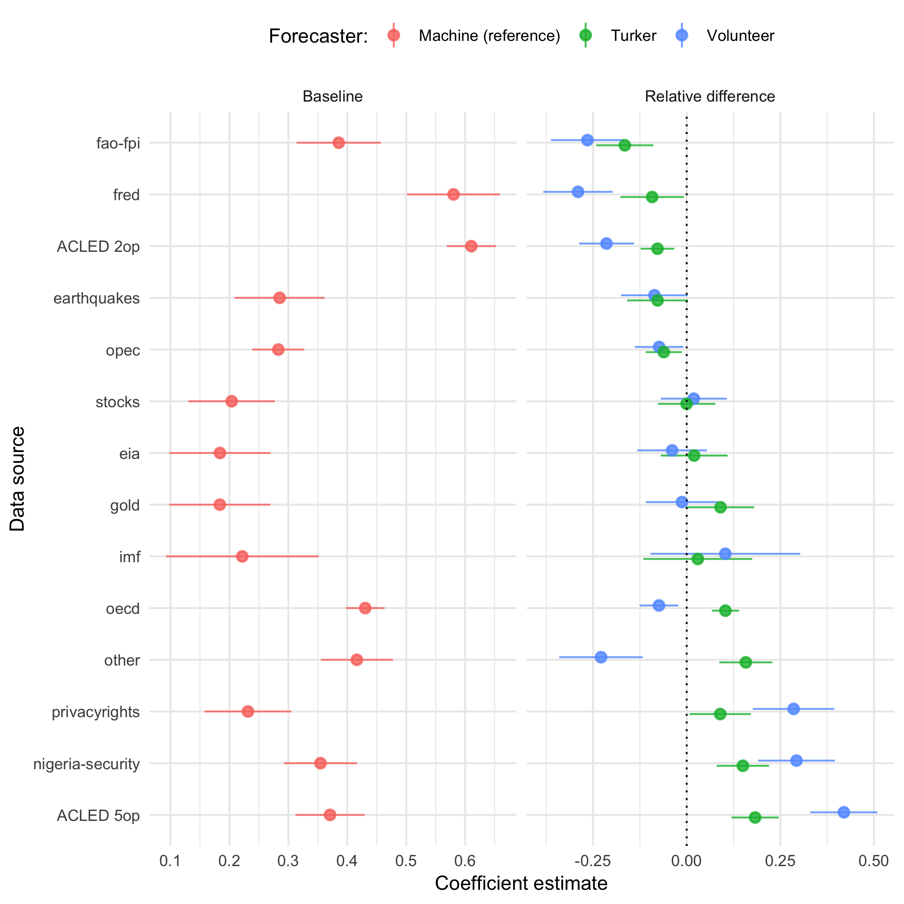

```{r setup, include=FALSE}
knitr::opts_chunk$set(echo = FALSE)

library(icon)
```

<!-- https://apreshill.github.io/data-vis-labs-2018/slides/06-slides_xaringan.html#13 -->

class: center

# Preview

.left.large[I'm going to show results of an exploratory analysis of the relative accuracy of volunteer, Amazon Mechanical Turker, and automated machine forecasts for a broad set of questions (IFPs)<sup>1</sup> in the HFC<sup>2</sup> during the first trial period (RCT-A<sup>3</sup>) that took place this year.]

.left.footnote[<sup>1</sup> Individual Forecasting Problem...I may not be able to keep myself from using HFC jargon. </br>
<sup>2 </sup> Hybrid Forecasting Competition </br>
<sup>3 </sup> Randomized controlled trial A]


---
class: middle, center

# Disclaimer

.left[This research is based upon work supported in part by the Office of the Director of National Intelligence (ODNI), Intelligence Advanced Research Projects Activity (IARPA), via 2017-17071900005. The views and conclusions contained herein are those of the authors and should not be interpreted as necessarily representing the official policies, either expressed or implied, of ODNI, IARPA, or the U.S. Government. The U.S. Government is authorized to reproduce and distribute reprints for governmental purposes notwithstanding any copyright annotation therein.]


---
class: center, middle, inverse

# Hybrid Forecasting Competition

.pull-left[]

.pull-right[]

---

# Project goal

>The HFC program is developing and testing hybrid geopolitical forecasting systems. These systems **integrate human and machine forecasting components** to create maximally accurate, flexible, and scalable forecasting capabilities.

.right.small[From https://www.hybridforecasting.com]

The idea is to overcome some of the respective weaknesses of human and machine-generated forecasts by combining them in some to be determined fashion.

Human-generated forecasts are flexible, but subject to cognitive biases and scalability issues.

Machine-generated forecasts are reliable and scalable, but ill-suited for idiosyncratic or emerging issues.


---
background-image: url('img/screenshot-splash.png')
background-size: contain


---
background-image: url('img/screenshot-question.png')
background-size: contain


---

# Scoring

Multinomial Brier score:

$$mBS = \sum_{i=1}^R(f_i - o_i)^2$$

- $R$ is the number of answer options, $f$ the vector of weights summing to 1, and $o$ a 0/1 vector marking the correct option
- ranges from 0 (good) to 2 (bad)

--

Ordered Brier score: 

1. Split the ordinal categories (A-B-C-D) into cumulative binary pairs, aggregating the forecast probabilities for each grouping of categories (A-BCD; AB-CD; ABC-D). 
2. Calculate the multinomial Brier score for each of the binary categories.
3. Average across the binary category scores to obtain the final Brier score. 

- also ranges from 0 to 2
- "near misses" are penalized less than far misses


---
class: center, middle, inverse

# The Hybrid part:

# Some users could see time series charts and machine forecasts for some IFPs


---

# How this works

- An automated system is collection and updating data from several data sources
- An automated system identifies if data for a particular question is available

If so:

- Chart the data
- An automated system generates a machine forecast


---

# basil-ts

Automated time series forecaster microservice

Implemented in R + Python Flask + RESTful API

Sketch of the internals: 

1. Parse incoming question and data
2. Produce a time series forecast using an automated ARIMA fitter<sup>1</sup>
3. Convert the time series forecast to answer option probabilities

Most of the complexity is related to automating the question/task parsing and handling edge cases.

.footnote[<sup>1</sup> [Hyndman & Khandakar 2008](http://www.jstatsoft.org/article/view/v027i03); R [forecast](https://cran.r-project.org/package=forecast) package]


---
class: middle, center, inverse

# Let's start looking at data and results

---

# Data

- RCT-A, the first trial period, lasted from 7 March to 7 September 2018
- Use subset of forecasts from 2 May to 1 August 2018

N fcasts, n IFPs


---

# Summary of some findings in the paper

Volunteers are better forecasts than Amazon Turkers

Machines are somewhere in the middle

Human forecasters who saw the machine forecasts did poorly; volunteer forecasts who saw only charts had overall the best performance

It's not clear why though, e.g.:
- they outperformed on questions that did not have data (charts and model)
- they outperformed volunteer forecasters who saw the machine forecasts even when the machine forecasts had good accuracy

Relative performance: where did the machine forecasts do better than human forecasters?

---

# Model overview

Group questions by data source, N=14 groups

Compare average Brier scores of volunteer, turker, and machine forecasts (reference category)

$$\textrm{Brier}_{ij} = \beta_{i}\textrm{DataSource}_i + \beta'_{ij}(\textrm{DataSource}_i\times\textrm{Forecaster}_j)$$

$\beta_i$ = average Brier score for machine forecasts for question group $i$

$\beta'_{ij}$ = average Brier score *relative to machine forecasts* for forecaster group $j$ in question group $i$

- Negative values $\rightarrow$ human forecasters did better
- Positive values $\rightarrow$ machine forecasts did better

---
class: center, middle




---

# ACLED 5-option


---

# OECD interest rates


---

# ACLED binary question


---

# Conclusions

Machine forecasts did well on count questions that require data aggregation 

Some of the overall hardest questions, and where to some extent human forecasters did better, are economic/financial monthly series 

- OECD interest rates
- FAO food price indices


---
class: center, middle, inverse

# Thank you!

Register to forecast at: 

Internal platform: 

.left[
`r icon::fa("envelope")`: [adbeger@gmail.com](mailto:adbeger@gmail.com)

`r icon::fa("github-square")`: https://github.com/andybega/asia-polmeth-2019

`r icon::fa("file")`: [link to paper (on github under docs/pdf/)](pdf/BegerWard_HFC_AsiaPolmeth2019.pdf)
]


