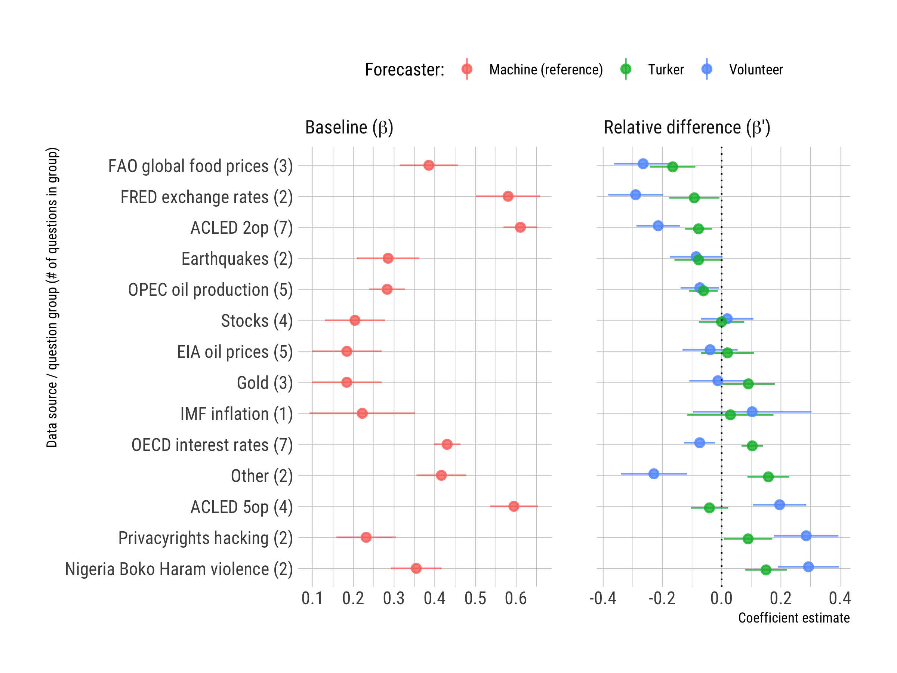

```{r setup, include=FALSE}
knitr::opts_chunk$set(echo = FALSE)

library(icon)
```

<!-- https://apreshill.github.io/data-vis-labs-2018/slides/06-slides_xaringan.html#13 -->

class: middle

# Disclaimer

This research is based upon work supported in part by the Office of the Director of National Intelligence (ODNI), Intelligence Advanced Research Projects Activity (IARPA), via 2017-17071900005. The views and conclusions contained herein are those of the authors and should not be interpreted as necessarily representing the official policies, either expressed or implied, of ODNI, IARPA, or the U.S. Government. The U.S. Government is authorized to reproduce and distribute reprints for governmental purposes notwithstanding any copyright annotation therein.


---
class: center, middle, inverse

# Hybrid Forecasting Competition (HFC)

---

# Project goal

>The HFC program is developing and testing hybrid geopolitical forecasting systems. These systems integrate human and machine forecasting components to create maximally accurate, flexible, and scalable forecasting capabilities.
>
>Human-generated forecasts may be subject to cognitive biases and/or scalability limits. Machine-generated (i.e., statistical, computational) forecasting approaches may be more scalable and data-driven, but are often ill-suited to render forecasts for idiosyncratic or newly emerging geopolitical issues. Hybrid approaches hold promise for combining the strengths of these two approaches while mitigating their individual weaknesses.
>
>Performers are developing systems that integrate human and machine forecasting contributions in novel ways. These systems are competing in a multi-year competition to identify approaches that may enable the Intelligence Community (IC) to radically improve the accuracy and timeliness of geopolitical forecasts.

.small[From https://www.hybridforecasting.com]


---
background-image: url('img/screenshot-splash.png')
background-size: contain


---
background-image: url('img/screenshot-question.png')
background-size: contain


---

# Scoring

Multinomial Brier score:

$$mBS = \sum_{i=1}^R(f_i - o_i)^2$$

- $R$ is the number of answer options, $f$ the vector of weights summing to 1, and $o$ a 0/1 vector marking the correct option
- ranges from 0 (good) to 2 (bad)

--

Ordered Brier score: 

1. Split the ordinal categories (A-B-C-D) into cumulative binary pairs, aggregating the forecast probabilities for each grouping of categories (A-BCD; AB-CD; ABC-D). 
2. Calculate the multinomial Brier score for each of the binary categories.
3. Average across the binary category scores to obtain the final Brier score. 

- also ranges from 0 to 2
- "near misses" are penalized less than far misses


---
class: center, middle, inverse

# The Hybrid part:

# Some users could see time series charts and machine forecasts for some IFPs


---

# How this works

- dig


---

# Data

- RCT-A, the first trial period, lasted from 7 March to 7 September 2018
- Use subset of forecasts from 2 May to 1 August 2018

N fcasts, n IFPs


---

# Summary of some findings in the paper

Volunteers are better forecasts than Amazon Turkers

Machines are somewhere in the middle

Human forecasters who saw the machine forecasts did poorly; volunteer forecasts who saw only charts had overall the best performance

It's not clear why though, e.g.:
- they outperformed on questions that did not have data (charts and model)
- they outperformed volunteer forecasters who saw the machine forecasts even when the machine forecasts had good accuracy

Relative performance: where did the machine forecasts do better than human forecasters?

---

Two models


---
class: center, middle




---

# ACLED 5-option


---

# OECD interest rates


---

# ACLED binary question


---

Machine forecasts did well on count questions that require data aggregation 

Some of the overall hardest questions, and where to some extent human forecasters did better, are economic/financial monthly series 

- OECD interest rates
- FAO food price indices


---
class: center, middle, inverse

# Thank you!

Register to forecast at: 
Internal platform: 

.left[
`r icon::fa("envelope")`: [adbeger@gmail.com](mailto:adbeger@gmail.com)

`r icon::fa("github-square")`: https://github.com/andybega/asia-polmeth-2019

`r icon::fa("file")`: [link to paper (on github under docs/pdf/)](pdf/BegerWard_HFC_AsiaPolmeth2019.pdf)
]


